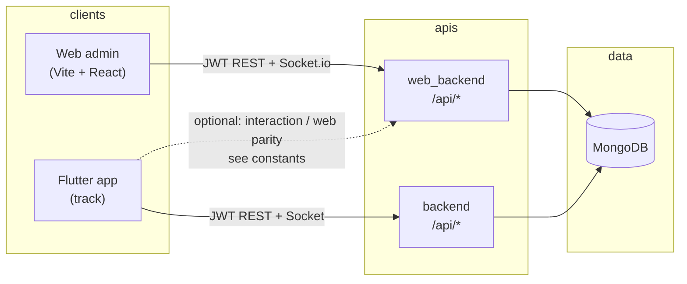
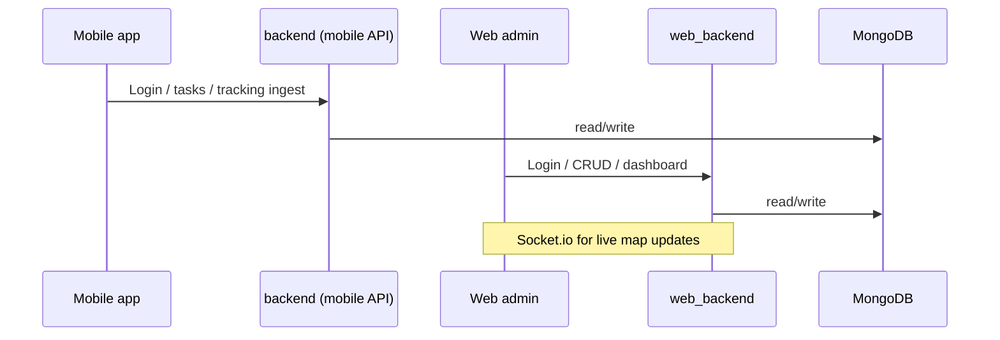

# LiveTrack — Project flow and modules

This document describes how the **mobile app** (`track/`), **web admin** (`web/`), and **APIs** (`backend/`, `web_backend/`) fit together, and how major **modules** map to routes and services.

---

## 1. Repository layout

| Area | Path | Role |
|------|------|------|
| Flutter mobile | `track/` | Field employee app: attendance, tasks, GPS, visits, leads, products |
| Web admin | `web/` | React (Vite) dashboard for admins/managers |
| Web API | `web_backend/` | Primary HTTP + Socket.io API for the web app; company admin, CRM, ops, subscriptions, super-admin |
| Mobile API | `backend/` | Companion API tuned for mobile clients (tasks, tracking ingest, attendance, uploads, etc.) |

Both backends target **MongoDB** and use **JWT** for authenticated requests. Production defaults in the Flutter app point at two hosts: a mobile-oriented API and a web-oriented API (see `track/lib/config/constants.dart` — override with `--dart-define=APP_API_BASE_URL` / `APP_WEB_API_BASE_URL`).

---

## 2. End-to-end architecture (high level)

**Interaction / dual-host behavior (mobile):** The app can use `baseUrl` for core HR/geo APIs and `webBaseUrl` for features that must match the web stack (for example interaction REST and Socket, when `interactionUseWebHost` is true). After login on the primary host, the app may perform a secondary login against the web host and store `interaction_access_token` so chat and web-aligned features work without changing the geo login server.

---

## 3. Web application — flow and routes

### 3.1 Startup and auth

1. User opens the SPA; React Router resolves the URL.
2. **`ProtectedRoute`** checks `AuthContext`: if there is no valid session, redirect to **`/login`** with `state.from` for post-login return.
3. **`SuperAdminRoute`** (under **`/super`**) adds an extra gate so only super-admin users see the partner/main admin console.

### 3.2 Route map (conceptual groups)

| Group | Base path | Purpose |
|-------|-----------|---------|
| Public | `/login` | Sign-in |
| Onboarding | `/company-setup` | Initial company setup (protected) |
| Tenant dashboard | `/dashboard/*` | Main admin workspace (lazy-loaded pages) |
| Super admin | `/super/*` | Cross-tenant: companies, licenses, plans, payments, integrations, catalog products, settings |

**Dashboard children** (from `web/src/App.jsx`), grouped by product area:

- **Home & account:** `/dashboard` (home), `profile`, `settings`, `settings/organization`, `settings/organization-info`, `settings/roles`
- **Commercial:** `billing`, `our-products`, `support`
- **People:** `users`, `users/new`, `users/import`, `users/:id`, `users/:id/employee`
- **Track (CRM + field):** `track/customers`, `track/customers/*`, `track/fieldtasks`, `track/visits`, `track/leads`, `track/livetrack`
- **Operations:** `operations/map`, `operations/attendance/*`, `operations/leave`, `operations/holidays`, `operations/expenses`, `operations/geofences`, `operations/reports`, `operations/modules`

Unknown paths fall through to **`/dashboard`**.

### 3.3 UI navigation

The sidebar (`web/src/components/layout/Sidebar.jsx`) mirrors these groups: Dashboard, Employees, Track (customers, visits, leads, LiveTrack), Operations (leave, holidays, attendance subtree, etc.), configuration (billing, organization), Our Products, Support, Settings.

### 3.4 “Platform modules” page

**`/dashboard/operations/modules`** (`PlatformModulesPage.jsx`) is a **product roadmap / capability overview** (Phase 1 shipped themes vs Phase 2+ ideas). It is documentation in the UI, not a dynamic feature-flag engine.

---

## 4. Mobile application — flow and screens

### 4.1 Application bootstrap (`track/lib/main.dart`)

Order of concerns:

1. **Widgets binding**, optional **Android alarm** init for attendance reminders.
2. **Firebase** init and **FCM** background handler registration.
3. **Background location** plugin init with a Dart entrypoint that forwards positions to **`LiveTrackingService`** and **`PresenceTrackingService`**.
4. **Providers:** `ThemeProvider`, **`AuthBloc`**.
5. **`MaterialApp`** with `DeactivationCheckWrapper` (subscription/account deactivation handling), theme, and **`home: SplashScreen`**.

### 4.2 Splash → first screen (`SplashScreen`)

1. Restore theme color from preferences.
2. If stored JWT exists and base URL did not change: optionally resume **live tracking** if a task is still active and the native tracker is running; otherwise go to **`DashboardScreen`** or **`LiveTrackingScreen`** as appropriate.
3. If no token: **`LoginScreen`**.

### 4.3 Main shell (bottom-level navigation)

`track/lib/navigation/main_shell_navigation.dart` defines the primary **four** destinations switched by index:

| Index | Screen | Module |
|-------|--------|--------|
| 0 | `AttendanceSummaryScreen` | Attendance |
| 1 | `DashboardScreen` | Home / tasks / products banner |
| 2 | `VisitsScreen` | Visits |
| 3 | `LeadListScreen` | Leads |

Other flows (tasks, map, customer add, settings, profile, products catalog, etc.) are reached via **push** routes from the dashboard menu, FAB, or list items — see `track/lib/screens/`:

- **`auth/`** — login, forgot password  
- **`dashboard/`** — home hub  
- **`attendance/`** — punch flow, camera, day detail, summary  
- **`geo/`** — tasks list, task detail, live tracking, OTP, arrived, proofs, maps  
- **`customers/`** — company customers, detail tabs  
- **`visits/`** — visit list / smart visit sync (when enabled)  
- **`leads/`** — lead list and detail  
- **`leave/`** — leave requests  
- **`products/`** — catalog and product detail (partner “Our products” style content)  
- **`profile/`**, **`settings/`** — user and permissions  

Services under `track/lib/services/` encapsulate HTTP calls to **`AppConstants.baseUrl`** and, where configured, **`webBaseUrl`** / interaction APIs.

---

## 5. Web backend — modules and HTTP surface

Mounted from `web_backend/src/routes/index.js`:

| Prefix | Typical responsibility |
|--------|-------------------------|
| `/api/auth` | Login, session, password |
| `/api/super` | Super-admin tenant and platform management |
| `/api/company` | Company profile, branches, org setup |
| `/api/company/subscription` | Tenant subscription (admin role) |
| `/api/users` | Employees / RBAC users |
| `/api/customers` | Customer CRM |
| `/api/fieldtasks` | Field tasks / assignments |
| `/api/tracking` | Location ingest and queries |
| `/api/tracking/visits` | Visit APIs |
| `/api/dashboard` | Aggregates for home |
| `/api/geofences` | Geofence CRUD |
| `/api/ops` | Operations (attendance approval, expenses, reports, etc.) |
| `/api/company-visits` | Company-scoped visits |
| `/api/leads` | Leads |
| `/api/company-products` | Marketing products for tenants / portfolio |

Additional wiring in `server.js`: **rate limiting**, **Helmet**, **CORS** (allow-list + Vercel + localhost dev), **`/api/subscription/webhook`** with raw body for payment providers, **Socket.io** (`sockets/`), and **location realtime** services.

---

## 6. Mobile backend — modules and HTTP surface

Mounted from `backend/index.js` (static files for `uploads/`, `selfie/`):

| Prefix | Typical responsibility |
|--------|-------------------------|
| `/api/auth` | Mobile auth |
| `/api/tasks` | Tasks assigned to field users |
| `/api/customers` | Customer data for mobile |
| `/api/tracking` | GPS ingest and history |
| `/api/notifications` | Push-related or in-app notifications |
| `/api/attendance` | Punch and attendance payloads |
| `/api/leave` | Leave |
| `/api/company-visits` | Visits |
| `/api/ops` | Miscellaneous ops endpoints used by app |
| `/api/leads` | Leads |
| `/api/products` | Company products for in-app catalog |

Socket.io is attached via `attachSocketIO` for realtime updates where implemented.

---

## 7. “Modules” in the business sense

These are the **functional domains** implemented across web + app + APIs:

1. **Identity & company** — Auth JWT, company setup, branches, org info, roles (web-heavy).  
2. **Workforce** — Users, onboarding, profile, attendance (web approval + mobile punch), leave, holidays.  
3. **Field execution** — Field tasks, statuses, live GPS, geofences, LiveTrack map on web.  
4. **CRM** — Customers, segments/tags/notes (per API), leads and follow-ups.  
5. **Visits** — Visit logs, smart visit automation (mobile flag in constants).  
6. **Operations** — Map, expenses, reports, platform capabilities page.  
7. **Commercial** — Subscriptions, billing UI, payment webhooks, licenses (super-admin), **company products** (tenant catalog + super-admin portfolio, `showInApp` / banners).  
8. **Super-admin** — Multi-tenant administration at `/super` with separate layout and routes.

---

## 8. Related READMEs

- `web/README.md` — Vite env and quick route list  
- `web_backend/README.md` — API and Socket overview  
- `track/README.md` — Flutter app notes  

---

## 9. Diagram: request flow (typical day)

---

*Generated for the LiveTrack monorepo. Update this file when you add major routes, services, or deployment hosts.*
